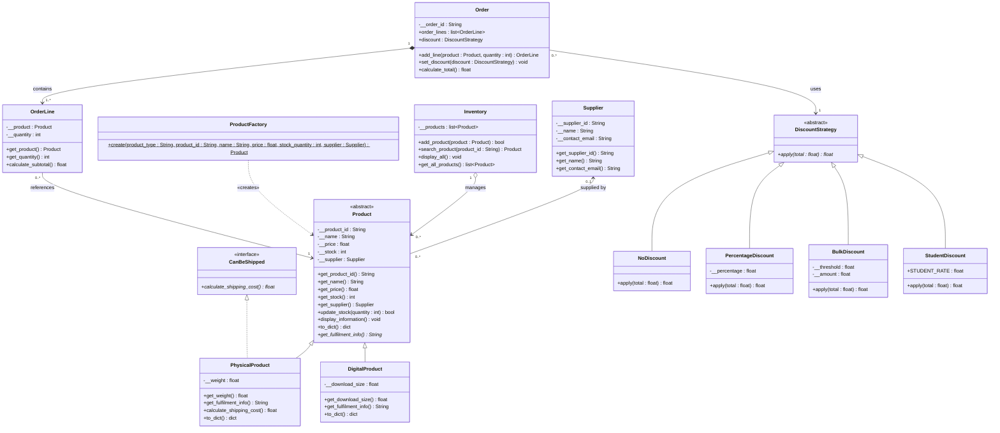

# UML Class Diagram — Lab 9 (Design Patterns & Error Handling)

```mermaid
classDiagram
    class Supplier {
        -__supplier_id : String
        -__name : String
        -__contact_email : String
        +get_supplier_id() String
        +get_name() String
        +get_contact_email() String
    }

    class Inventory {
        -__products : list~Product~
        +add_product(product : Product) bool
        +search_product(product_id : String) Product
        +display_all() void
        +get_all_products() list~Product~
    }

    class Product {
        <<abstract>>
        -__product_id : String
        -__name : String
        -__price : float
        -__stock : int
        -__supplier : Supplier
        +get_product_id() String
        +get_name() String
        +get_price() float
        +get_stock() int
        +get_supplier() Supplier
        +update_stock(quantity : int) bool
        +display_information() void
        +to_dict() dict
        +get_fulfilment_info()* String
    }

    class CanBeShipped {
        <<interface>>
        +calculate_shipping_cost()* float
    }

    class PhysicalProduct {
        -__weight : float
        +get_weight() float
        +get_fulfilment_info() String
        +calculate_shipping_cost() float
        +to_dict() dict
    }

    class DigitalProduct {
        -__download_size : float
        +get_download_size() float
        +get_fulfilment_info() String
        +to_dict() dict
    }

    class ProductFactory {
        +create(product_type : String, product_id : String, name : String, price : float, stock_quantity : int, supplier : Supplier)$ Product
    }

    class Order {
        -__order_id : String
        +order_lines : list~OrderLine~
        +discount : DiscountStrategy
        +add_line(product : Product, quantity : int) OrderLine
        +set_discount(discount : DiscountStrategy) void
        +calculate_total() float
    }

    class OrderLine {
        -__product : Product
        -__quantity : int
        +get_product() Product
        +get_quantity() int
        +calculate_subtotal() float
    }

    class DiscountStrategy {
        <<abstract>>
        +apply(total : float)* float
    }

    class NoDiscount {
        +apply(total : float) float
    }

    class PercentageDiscount {
        -__percentage : float
        +apply(total : float) float
    }

    class BulkDiscount {
        -__threshold : float
        -__amount : float
        +apply(total : float) float
    }

    class StudentDiscount {
        +STUDENT_RATE : float
        +apply(total : float) float
    }

    Product <|-- PhysicalProduct
    CanBeShipped <|.. PhysicalProduct
    Product <|-- DigitalProduct
    Supplier "0..1" <-- "0..*" Product : supplied by
    Inventory "1" o--> "0..*" Product : manages
    ProductFactory ..> Product : «creates»
    Order "1" *--> "1..*" OrderLine : contains
    OrderLine "0..*" --> "1" Product : references
    Order "0..*" --> "1" DiscountStrategy : uses
    DiscountStrategy <|-- NoDiscount
    DiscountStrategy <|-- PercentageDiscount
    DiscountStrategy <|-- BulkDiscount
    DiscountStrategy <|-- StudentDiscount
```
